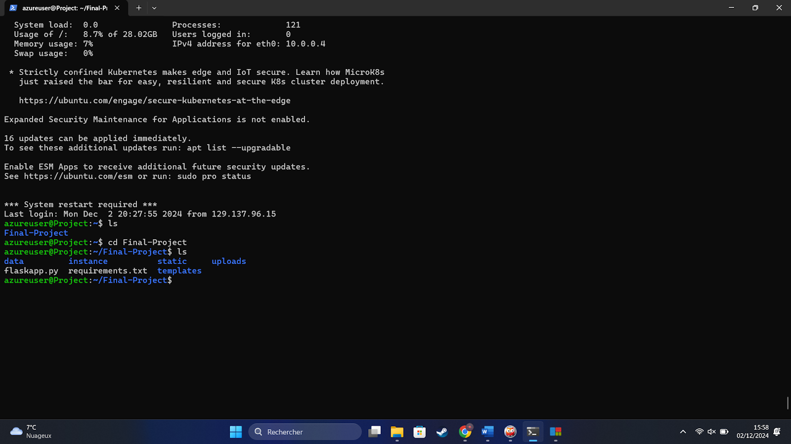
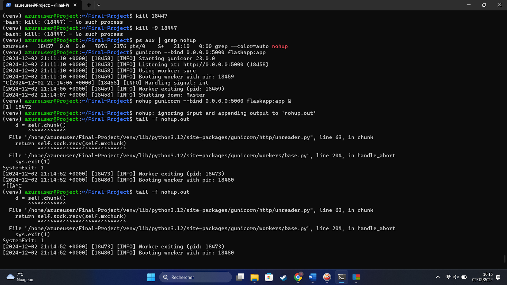
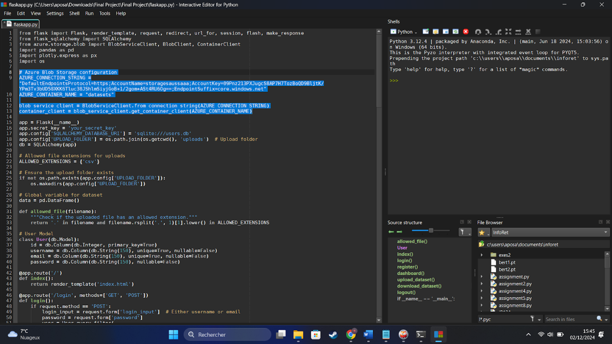

# Predictive Modeling and Web Application Project

## Project Overview
This project focuses on implementing machine learning (ML) models for predictive analysis and deploying an interactive web application on an Azure virtual machine (VM). The application integrates data loading, dashboard visualization, and ML model predictions, including churn prediction.

---

## Requirements
### Machine Learning Models
#### 1. Linear Regression  
A simple and interpretable ML algorithm used for predicting continuous target variables by finding the best-fit line between inputs and outputs. Suitable for tasks like forecasting sales or predicting house prices.

#### 2. Random Forest  
An ensemble learning algorithm that improves accuracy by constructing multiple decision trees. It handles both numerical and categorical data and is effective in solving large dataset problems.

#### 3. Gradient Boosting  
An advanced ensemble method that iteratively corrects errors from previous models using gradient descent. It delivers high accuracy for regression and classification tasks but requires careful hyperparameter tuning.

### Predictive Modeling Techniques Used
- Logistic Regression  
- Decision Tree  
- Random Forest  

### Key Retail Questions Answered
1. What factors are the strongest predictors of hospital readmission in diabetic patients?  
2. How well can we predict hospital readmission in this dataset with limited features?  

---

## Web Server Setup
1. **Azure VM Setup**:
   - Created a virtual machine (VM) and added an SSH key.
   - Transferred the project files to the VM.
  
[](images/image1.png)
[](images/image2.png)
[](images/image3.png)

2. **Environment Configuration**:
   - Created and activated a virtual environment (`venv`).
   - Installed project dependencies from `requirements.txt`.
  
[](images/image4.png)
[](images/image5.png)
[](images/image6.png)

3. **Web Server Deployment**:
   - Installed and configured Gunicorn to run the Flask application.
   - Used `nohup` to ensure the Flask app remains running after exiting the VM.
   - Verified the server status using the `tail` command.
  
[](images/image7.png)
[](images/image8.png)

---

## Datastore and Data Loading
1. Created a `datasets` container in Azure for storing data.  
2. Retrieved access keys and integrated them into the Flask application.  
3. Modified upload and download functions to establish a connection with Azure for seamless data management.

[](images/image9.png)
[](images/image10.png)
[](images/image11.png)
[](images/image12.png)
[](images/image13.png)

---

## Interactive Web Page
### Features
1. **Data Loading Web App**:  
   Upload and manage datasets directly through the web interface.

2. **Dashboard and ML Predictions**:  
   A user-friendly dashboard to visualize data insights and apply machine learning models, including churn prediction.

[](images/image14.png)
[](images/image15.png)
[](images/image16.png)
[](images/image17.png)
[](images/image18.png)

---

## How to Run
1. Clone the repository and navigate to the project directory:
   ```bash
   git clone <repository_url>
   cd <project_directory>
   ```
2. Set up a virtual environment and install dependencies:
   ```bash
   python3 -m venv venv
   source venv/bin/activate
   pip install -r requirements.txt
   ```
3. Deploy the application using Gunicorn:
   ```bash
   gunicorn -w 4 -b 0.0.0.0:5000 app:app
   ```
4. Access the application in your browser at `http://<VM_IP>`.

---

## Contributors
- Almaamar Alkiyumi  
- Apolline Saussard  
- Jason Yang
